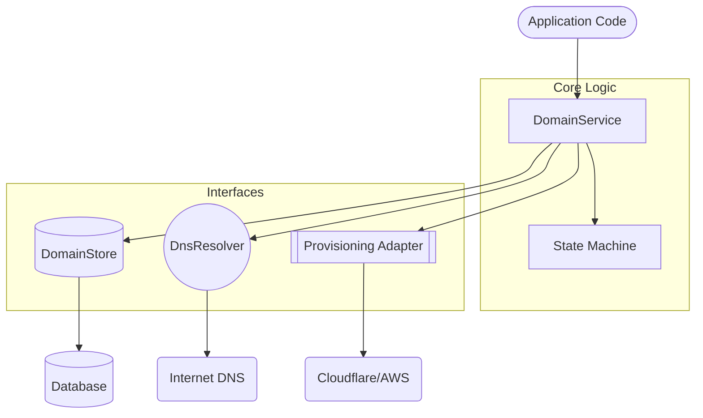

# Custom Domain SDK Documentation

A production-grade TypeScript SDK for managing custom domains with a strict state machine, provider-agnostic persistence, and DNS-based verification.

---

## Table of Contents

1. [Overview](#overview)
2. [Architecture](#architecture)
3. [Domain Lifecycle](#domain-lifecycle)
4. [Core Components](#core-components)
    - [DomainService](#domainservice)
    - [DomainStore](#domainstore)
    - [DnsResolver](#dnsresolver)
    - [AdapterInterface](#adapterinterface)
5. [Getting Started](#getting-started)
6. [Advanced Usage](#advanced-usage)
    - [Custom Data Stores](#custom-data-stores)
    - [Custom Provisioning Adapters](#custom-provisioning-adapters)
7. [Error Handling](#error-handling)
8. [Best Practices](#best-practices)

---

## Overview

The `custom-domain-sdk` provides a reliable way to add "Custom Domain" functionality to your SaaS application. It handles the complexities of ownership verification, DNS propagation, and SSL certificate provisioning through a deterministic state machine.

It is designed to be:
- **Runtime Agnostic**: Works on Node.js, Bun, Edge Functions, etc.
- **Persistence Agnostic**: Use any database by implementing a simple interface.
- **Provider Agnostic**: Easily switch between Cloudflare, AWS, or any other infrastructure provider.

---

## Architecture

The SDK follows a modular architecture where the core logic is decoupled from external services.



---

## Domain Lifecycle

The lifecycle of a domain is governed by a strict state machine. Transitions are validated to ensure the domain moves through the correct sequence of steps.

| State | Description | Next Valid States |
| :--- | :--- | :--- |
| `created` | Initial entry in the database. | `pending_verification` |
| `pending_verification` | Waiting for the user to add a TXT record. | `verified`, `failed` |
| `verified` | Ownership confirmed via DNS. | `pending_dns`, `failed` |
| `pending_dns` | User needs to point CNAME/A record to your edge. | `provisioning_ssl`, `failed` |
| `provisioning_ssl` | Adapter is calling external API to issue SSL. | `active`, `failed` |
| `active` | Domain is fully configured and live. | `failed` |
| `failed` | An error occurred during the process. | *Terminal (needs manual reset)* |

---

## Core Components

### DomainService

The `DomainService` is the primary entry point for the SDK. It coordinates between the store, dns resolver, and adapter.

**Key Methods:**
- `createDomain(hostname)`: Initializes the domain and returns verification instructions.
- `checkVerification(hostname)`: Validates the TXT record and transitions to `verified`.
- `getDnsInstructions(hostname)`: Returns the CNAME/A records the user needs to set.
- `provisionDomain(hostname)`: Triggers the external provider (e.g., Cloudflare) to start SSL issuance.
- `syncStatus(hostname)`: Polls the external provider for the final `active` status.

### DomainStore

An interface for persisting domain data. 

```typescript
export interface DomainStore {
    getByHostname(hostname: string): Promise<Domain | null>;
    create(domain: Domain): Promise<Domain>;
    update(domain: Domain): Promise<Domain>;
}
```

### DnsResolver

Handles DNS lookups for TXT, CNAME, and A records. The SDK provides a default `NodeDnsResolver`.

### AdapterInterface

Interacts with third-party providers. This is where you implement logic for Cloudflare Custom Hostnames or AWS CloudFront.

---

## Getting Started

### 1. Installation

```bash
bun add custom-domain-sdk
```

### 2. Configuration

First, implement your chosen adapter and store.

```typescript
import { DomainService, MemoryDomainStore, NodeDnsResolver } from "custom-domain-sdk";

const sdk = new DomainService({
  store: new MemoryDomainStore(),
  dns: new NodeDnsResolver(),
  adapter: myCloudflareAdapter, // See Adapters section
  cnameTarget: "edge.yourapp.com"
});
```

### 3. Implementation Flow

```typescript
// 1. Initiate domain setup
const step1 = await sdk.createDomain("user-domain.com");
console.log("Provide these TXT records to user:", step1.verification);

// 2. Later, when user clicks 'Verify'
try {
  const step2 = await sdk.checkVerification("user-domain.com");
  console.log("Verified! Now show CNAME instructions:", step2.provisioning);
} catch (e) {
  console.error("DNS records not found yet.");
}

// 3. Provisioning (after CNAME is set)
await sdk.provisionDomain("user-domain.com");

// 4. Final Sync
const final = await sdk.syncStatus("user-domain.com");
if (final.status === "active") {
  console.log("Domain is live!");
}
```

---

## Advanced Usage

### Custom Data Stores

To use a database like Prisma, Drizzle, or MongoDB, implement the `DomainStore` interface:

```typescript
class PrismaDomainStore implements DomainStore {
  async getByHostname(hostname: string) {
    return prisma.domain.findUnique({ where: { hostname } });
  }
  // Implement create and update...
}
```

### Custom Provisioning Adapters

If you use a provider other than Cloudflare, implement the `AdapterInterface`:

```typescript
class MyCustomAdapter implements AdapterInterface<any> {
    async createCustomHostname(hostname: string) {
        // Logic to call your provider's API
    }
    // ...
}
```

---

## Error Handling

The SDK uses typed errors for better debugging. All SDK errors inherit from the base `DomainError` class.

- `DomainError`: Base class for all SDK-specific errors.
- `DomainNotFoundError`: Requested domain doesn't exist in the store.
- `DnsVerificationFailedError`: TXT or CNAME records didn't match the expected values.
- `InvalidStateTransitionError`: Attempted an invalid transition (e.g., `created` -> `active`). Thrown by the internal state machine.
- `ConfigurationError`: Thrown when the SDK is misconfigured (e.g., missing essential config parameters).

---

## Best Practices

1. **Background Jobs**: DNS verification and SSL provisioning can take time. Use background workers (like BullMQ or Inngest) to call `checkVerification` and `syncStatus`.
2. **Polling**: Implement exponential backoff when polling `syncStatus` for SSL issuance.
3. **Normalization**: The SDK automatically normalizes hostnames (lowercase, trim), but it's good practice to do this at the API entry point as well.
4. **Security**: Ensure that one user cannot register a domain owned by another user by checking ownership in your `DomainStore` implementation.
