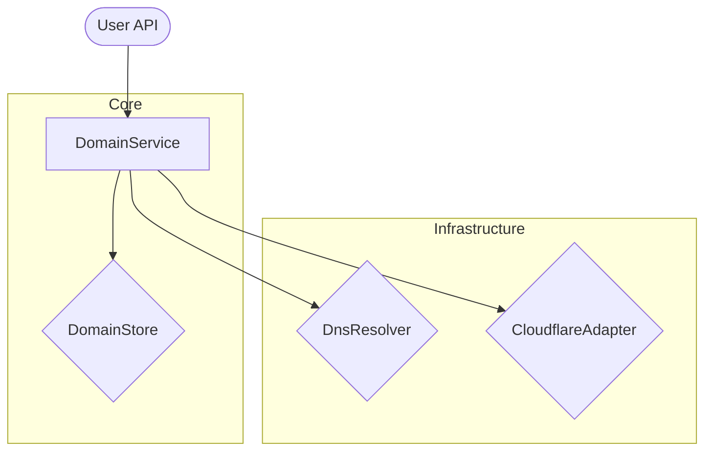

# Custom Domain SDK

A production-grade TypeScript SDK for managing custom domains using Cloudflare like Custom Hostnames. This SDK is framework-agnostic, database-agnostic, and implements a strict domain lifecycle state machine.

## Features

- **Strict State Machine**: Ensures deterministic transitions (`created` → `pending_verification` → `verified` → `pending_dns` → `provisioning_ssl` → `active`).
- **Framework Agnostic**: Works in Node.js, Bun, or any other JS runtime.
- **Provider Agnostic (Persistence)**: Abstracted behind a `DomainStore` interface.
- **Provider Agnostic (DNS)**: Abstracted behind a `DnsResolver` interface.
- **Typed Errors**: Proper error handling for easier debugging.

## Installation

```bash
bun add custom-domain-sdk
```

## Quick Start

```typescript
import { 
  DomainService, 
  MemoryDomainStore, 
  NodeDnsResolver 
} from "custom-domain-sdk";

const sdk = new DomainService({
  store: new MemoryDomainStore(),
  dns: new NodeDnsResolver(),
  adapter: myCloudflareAdapter,
  cnameTarget: "edge.yourapp.com"
});

// 1. Start lifecycle
const instructions = await sdk.createDomain("customer.com");

// 2. Poll for verification
await sdk.checkVerification("customer.com");

// 3. Get DNS target
const dnsInfo = await sdk.getDnsInstructions("customer.com");

// 4. Provision SSL
await sdk.provisionDomain("customer.com");

// 5. Sync status
await sdk.syncStatus("customer.com");
```

## Domain Lifecycle

The SDK enforces the following state transitions:

1. **created**: Internal record created.
2. **pending_verification**: Waiting for TXT record verification.
3. **verified**: TXT record matched.
4. **pending_dns**: Waiting for CNAME/A record to point to our edge.
5. **provisioning_ssl**: Calling Cloudflare to issue certificates.
6. **active**: Domain is live.
7. **failed**: Terminating state for any step.

## Architecture



## License

MIT
